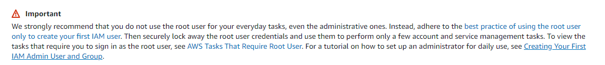
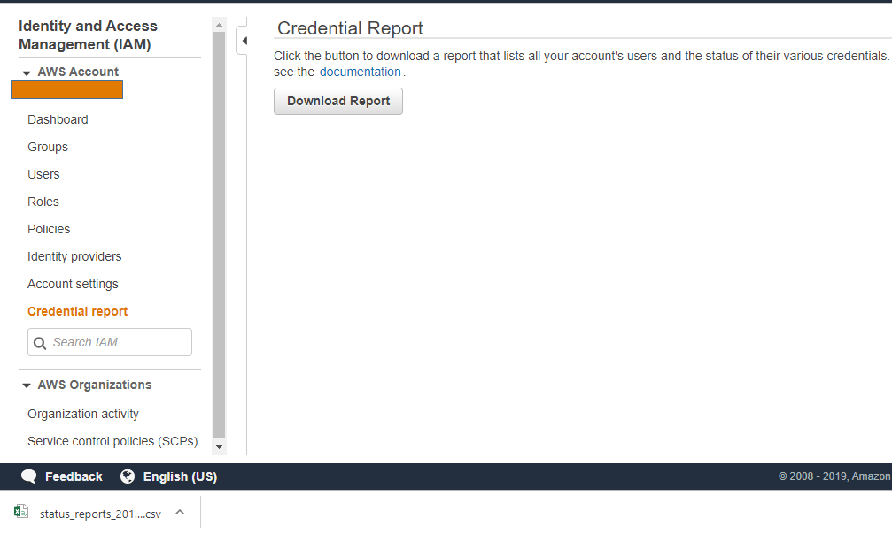

In my [previous post](/aws_security/iam/startingwithroot), I went into several best practices to deploy in your AWS account that add security to your account from the start. In this post, I'll be digging into some ideas that assist you to secure IAM even further. These Items continue to build an IAM security framework in AWS.

## What user account do I log in with?
AWS root user account is not an account for everyday use. The recommended first step to secure your AWS account is to create new a IAM user and use this new account for daily tasks.

 

Do not share the root credentials. Lock the root credentials away and only use them as a break glass or when you need to perform root functions.  Schedule a recurring meeting on your calendar for reviewing AWS credential reports. The purpose of these audits is to confirm no one is logging into the root account.

Log in with an IAM user account with MFA, [How to enable MFA](/blog/2019/aws_mfa), and least privileges.  

### A great idea for the root account's email address:
> You are almost done with deploying best practices on the root account. 

In your organization create an email distribution list for your cloud security alerts ex: CloudSecurityAlerts@secframe.com. Add the members of the security team to this distribution list. For every AWS account created in your environment, set the root email address as an alias on the distribution list. If someone attempts to change the password on any root AWS account, the entire security team gets alerted through this distribution list. If there are alerts sent by AWS to the root account, the entire security team gets alerted.

 
### Who gets an admin  IAM account?
Each individual using AWS will have at least one account or role. In most scenarios, you will see that one user mapped to one IAM user account. 

In more advanced AWS environments a best practice to deploy is to create a read-only account for a user to log into. When a person wants to make changes in AWS, they change or 'assume' a privileged role.  
 

### Shared user accounts
There is no scenario where it is OK to share an IAM user across teams. If you have these users in your accounts, they often look like networkAdmin, DbaAdmin, or AccountsAdmin. You need to enforce that each individual person using AWS gets a unique IAM user. Each user turns on MFA. 

If there is a network administrator who needs access to AWS, he gets a user. If network admin #2 needs to do work in AWS, she gets a separate account. With this standard, each individual action performed in AWS is tied back to an individual user.

 

### How should you name IAM users in your environment?
Start by creating a naming standard. With a standard in place, it is easy for any auditor to find out which IAM user ties to which person at your company. If your business has a naming standard in place for users, you can easily piggyback off that. If you need a place to start and want some help leading the discussion.

Often the naming convention at organizations combine first and last name and/or employee numbers. Here are a few naming standards for our favorite employee at secframe, John Smith employee ID # 1234

| Naming Standard |	Example |
| :---: | :--- |
| First initial + last initial + employee id |	JS1234 |
| First name + _ + last name |	John_Smith |
| First initial + last name |	JSmith |
| Company Initials + Employee ID |	SF1234 |
 

### Prevent password reuse attacks
IAM users should have unique passwords different from their network logins. Having unique passwords for different applications your organization removes risk from password reuse attacks. NIST and Microsoft have great guidelines in place about their policy on passwords.  In my [Microsoft Password Policy Post](/blog/2019/microsoft_password_policy), I go into some great detail on the topic.  Please read that for further details.
