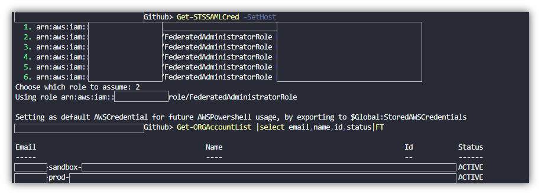

The AWS root user is the first identity that has access to your AWS account. Amazon's full documentation on IAM best practices for the root account is extensive. For more links to other AWS security best practices please see: SecFrame’s list of AWS links.The email address associated with this account is the recovery email address for the entire AWS account. It is the God account.

Best practices of AWS identity management has you make an AWS account and then complete series of tasks which add a high degree of security to your AWS account.

The steps outlined in the AWS IAM Best Practices:
1. Turn on MFA for the root account 
2. Make an IAM user inside AWS
3. Grant Admin Privileges to the User
4. Remove any access keys for the root user
5. Sign out of AWS
6. Sign into AWS with your account id, and the new IAM User
aws iam root security best practices
This post will outline decisions you have to make in order to secure the root account with MFA, why you should remove the root account's access keys for programmatic access, and what happens if you need to find the root account's email address.

The arn identifier for the account and root is:

`arn:aws:iam::{ACCOUNT_ID}:root`
The root user is the account itself.  When you sign into this 'user' you are performing functions as the account.

Source: [AWS Reference Identifiers](https://docs.aws.amazon.com/IAM/latest/UserGuide/reference_identifiers.html)

Important: We strongly recommend that you do not use the root user for your everyday tasks, even the administrative ones. Instead, adhere to the best practice of using the root user only to create your first IAM user. Source :Root User Guide

> It’s important to note that there are items that only the root user can do: AWS Tasks that require root credentials. [Source](https://docs.aws.amazon.com/IAM/latest/UserGuide/id_root-user.html)

### AWS Tasks where you must use root is currently a list of 14 items:
- Modify root user details.
- Change your AWS support plan.
- View Billing tax invoices.
- Close an AWS account.
- Sign up for GovCloud.
- Submit a Reverse DNS for Amazon EC2 request.
- Create a CloudFront key pair.
- Change the Amazon EC2 setting for longer resource IDs.
- Enable MFA Delete on S3 Bucket
- Editing or deleting an Amazon S3 bucket policy that includes an invalid VPC ID or VPC endpoint ID.
- Request removal of the port 25 email throttle on your EC2 instance.
- Find your AWS account canonical user ID in the console. See BONUS Content at the end of this blog for more details on this one
- Restoring IAM user permissions. Change your account settings using the Billing and Cost Management console. You can view and edit your contact and alternate contact information, the currency that you pay your bills in, the Regions that you can create resources in, and your tax registration numbers.


## Key decisions for securing your AWS account's root user
### Best practice #1: Turn on MFA for the root account.
See my [Enable MFA post (with pictures!)](/blog/2019/aws_mfa) for a guide on enabling MFA for any AWS account. By securing the root account with MFA you make sure that the person logging into the root account is actually approved to log in. There are support cases where people lose their root account and the attacker enables MFA on your account with the attacking user’s MFA device.  The attacker implemented a security control before the actual owner of the account. The attacker beat the owner at a race to security.

#### MFA Consideration Items:
Why enable MFA in a business environment if you are the only person who has access to the email?
1. Anyone in your organization with administrative access to your email system can take control of any email account.
1. Controlling the email account that administrator can perform a password reset on the AWS root account and get access to the password reset link sent in the email.
1. The owner of the email address can then reset your root account password.
How are you going to back up the MFA token? What happens if it is lost, stolen, or damaged?
1. You can backup your MFA device using many numerous backup tools. I use titanium backup to backup my Android phone.
1. You can simply backup the QR code. Store your QR code in a password vault. LastPass Password manager is a great free tool for this. If you lose your device and need to re-add MFA to gain access to your AWS account, you have a QR code handy.
1. You can choose a MFA app that backs up to the cloud. Authy and AndOTP are a great examples of a tools that completes this step.

### Best practice item #2: Remove Any Access Keys
The topic of where to store access keys comes up a lot in security forums. (For access to an AWS slack spaced, connect with me on Twitter or LinkedIn.) The consensus in the communities for the root user's access key leans toward deleting it. By deleting the key, you will remove the exposure to your account.aws 
*Remove the root user access key and remove the risk*

Items to consider:

- If you do not have an access key, you must have control of the root account email address for password recovery.

If you are wondering who else has access keys in your AWS account and AWS organization? Learn how to check for all user's access keys with my post here : [List All AWS Access Keys in an Organization](/blog/2019/aws_org_list_access_keys)


### What happens if you forget the root account email address and need to find it again? 
> I forgot the root email address. Now what?

If you forget the root email address associated with your account but still have administrative access to the account, please note: there are no API calls available to find the email address associated with the root account. Unless…

1. If you are associated with an AWS organization, and you can list organizations on the root AWS, you can call the AWS organization list to identify root email accounts associated with each AWS account.get root user email with aws organizations and powershell cli

1. If you have a premium support agreement with AWS you can use the support API calls to show tickets in your account. You can describe cases and see the email addresses associated with the case. This has no guarantee you’ll find the root address. It relies on the fact that you have cases opened and a professional support agreement.
1. Andres Riancho did experimentation with s3:GetBucketAcl,and found that sometimes he could find details about the account and root, depending on how S3 was used in the AWS account.  Details are in his [gist here](https://gist.github.com/andresriancho/f257ba10fee340243cfa3a775aa3eaba#file-get-display-name-py)


 

#### Bonus Content:
How to find your account’s canonical user ID without the root user?
```powershell 
$buckets = get-s3bucket
$region = 'us-east-1'
$objects = $buckets| %{Get-S3Object -BucketName $_.bucketName -region $region}
($objects |select-object -property owner -unique).owner.id
```