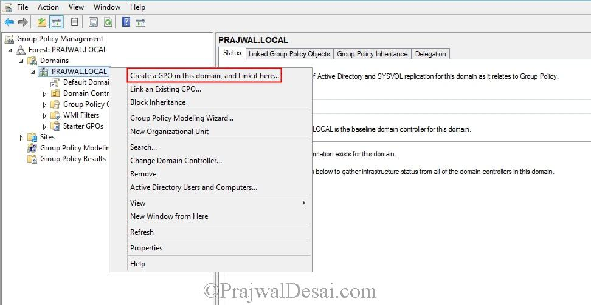
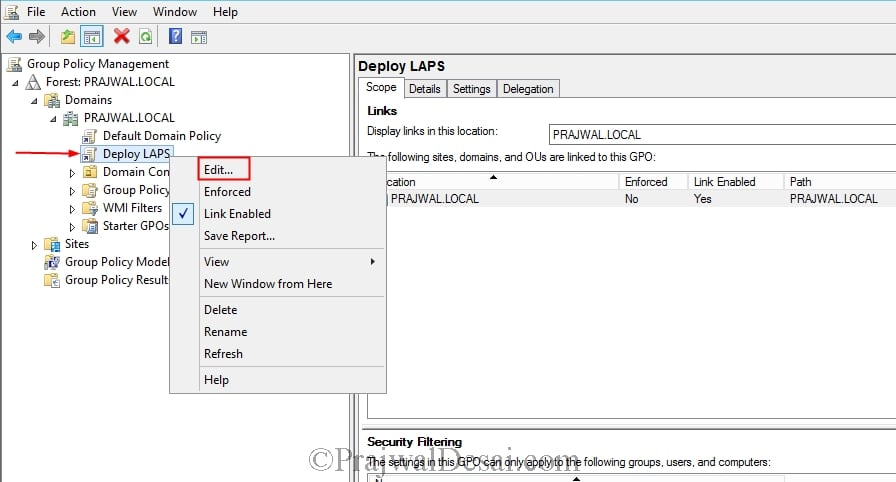
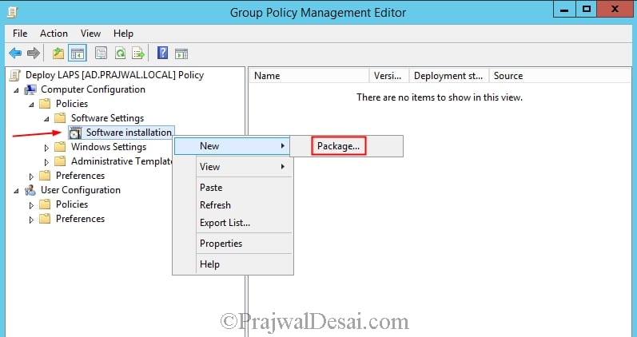
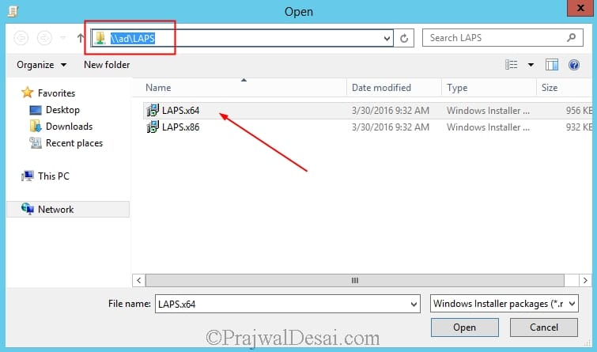
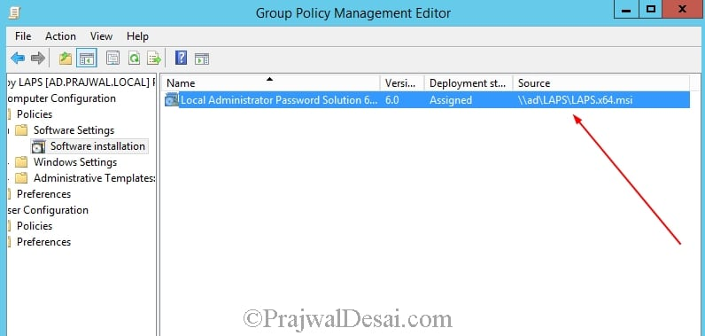
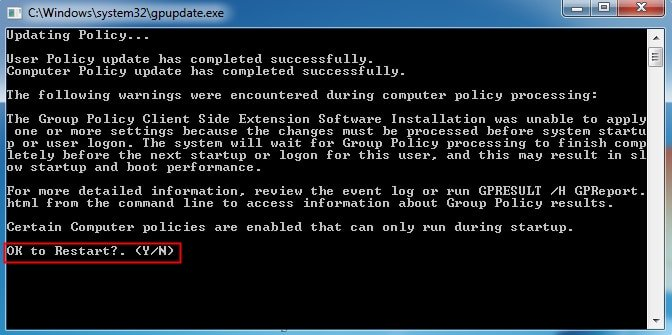
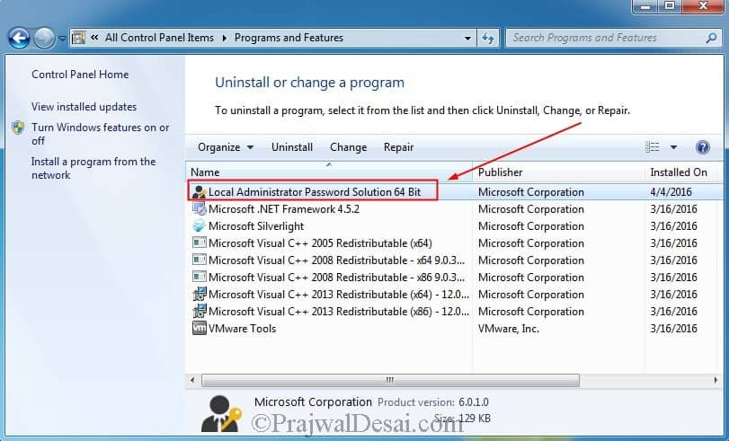

## How to install LAPS

**Don't overcomplicate things.**

[The full Microsoft Guide to installing LAPS](https://gallery.technet.microsoft.com/step-by-step-deploy-local-7c9ef772/file/150657/1/step%20by%20step%20guide%20to%20deploy%20microsoft%20laps.pdf)

---
### 3 Steps to install Laps
1. [Update Active Directory Schema](#step1)
2. [Create and Enable GPO for Password settings sand rotation policy](#step2)
3. [Install LAPS client into windows computers](#step3)

## Step 1 (step1)
### Update Active Directory Schema

I boiled this down to one function in powershell. The [Badblood Repo Laps Install Folder](https://github.com/davidprowe/BadBlood/tree/master/AD_LAPS_Install)
has the function `.BadBlood/AD_LAPS_Install/InstallLAPSSchema.ps1`

Which runs the following code. 

```powershell
function Get-ScriptDirectory {
    Split-Path -Parent $PSCommandPath
}
$scriptPath = Get-ScriptDirectory

copy-item -path ($scriptpath + "\admpwd.ps") -destination "C:\Windows\System32\WindowsPowerShell\v1.0\Modules"
get-childitem -path ($scriptpath + "\admpwd.ps") -recurse |Foreach-object {
    Copy-item -literalpath $_.fullname -destination "C:\Windows\System32\WindowsPowerShell\v1.0\Modules\admpwd.ps"
}
copy-item -path ($scriptpath + "\AdmPwd.admx") -destination "C:\Windows\PolicyDefinitions"
copy-item -path ($scriptpath + "\AdmPwd.adml") -destination "C:\Windows\PolicyDefinitions\en-US"

Import-Module ADMPwd.ps
Update-AdmPwdADSchema
Set-AdmPwdComputerSelfPermission -OrgUnit (Get-ADDomain).distinguishedname
```

If you are a Domain Administrator and Schema Administrator, and logged into a domain controller this function does the following for you:

1. Copies the LAPS powershell modules into the modules folder on the server you are logged into
2. Imports the LAPS GPO templates into the server
3. Extends the schema for LAPS
4. Adds the computer object property on the root of the domain to each computer to write its new custom administrative password to the admpwd attribute

> Step one complete by running one script

onto...

-------

## Step 2 (step2)
### Create and enable GPO for LAPS settings on the domain

There are two GPOs to configure in the domain: One for servers. One for workstations

| Computer type | Recommended LAPS setting |
| --- | --- |
| [Tier 0](/redforest/phase1/adminaccounts/tier-0-admins/) Domain Controllers | No LAPS installation |
| [Tier 1](/redforest/phase1/adminaccounts/serveradmins/) Servers | 7 day maximum password age |
| [Tier 2](/redforest/phase1/adminaccounts/workstationsadmins/) Workstation | 30 day maximum password age |

----
### Tier 2 LAPS GPO
Here's an outline of what the LAPS GPO should look like for workstations, tier 2 devices.
1. Create Two GPOs at the root of the domain:
  1. One for 'LAPS Workstation' 
  1. One for 'LAPS Server'

The settings are outlined as follows  
Setting Name  | Suggested Setting
---|---
  | 
  
---

## Step 3 (step3)
### Install LAPS client into Windows computers

Keep it easy. 
> Install Laps using the same GPO created in step 2

Automate the installation of LAPS onto all the windows machines on the domain.

1. Create a new GPO or use the GPO previously created in the step above

2. Edit the GPO created above

3. In Computer Configuration --> Policies --> Software Settings, Right click Software installation, an select 'New' --> 'Package'

4. Choose the LAPS software that is on share on the domain.  I often see the .msi in the Sysvol folder for ease of distribution

5. Verify the source is correct in the GPO

6. Wait 15 minutes on a remote machine on the domain and perform a `gpupdate /force`

7. LAPS should be installed on the workstation/server.


Per the pdf linked above:
> You now see that LAPS x64 has been imported. In case you are adding x86 LAPS, once you add the package be sure to edit the x86 package to uncheck the option Make this 32-bit X86 application available to Win64 machines. You will find this option when you right click the x86 package > Properties > Deployment. This will ensure that 64-bit computers get the 64-bit DLL, and 32-bit machines get the 32-bit DLL. Close the GPM editor.
----

## LAPS is now successfully deployed

Congratulations. Microsoft LAPS is now successfully deployed in the domain.

> Pictures from this post are from the Microsoft PDF linked at the top of the page.

