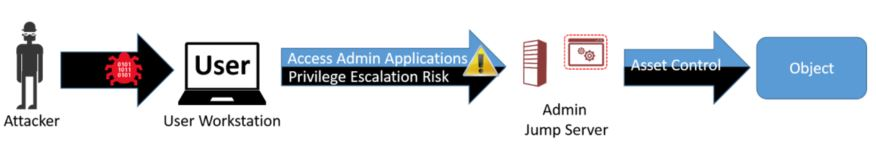

## What is a Privileged Access Workstation - PAW
The PAWs deployment is focused to restrict privileged Active Directory tasks to dedicated workstations to protect against credential theft.  

These workstations sole purpose in life is to perform administrative functions.  It is never used for daily tasks such as checking email, browsing the web, or reading reddit.  These entirety of the machines is separated from the standard workstations and servers on a domain so that there is no cross infection between PAWs and standard workstations and servers on the domain.

Microsoft's Privilege Access Workstation (PAW) instructions are published at [http://aka.ms/cyberpaw](http://aka.ms/cyberpaw). Unfortunately this article takes 80 minutes to read from start to finish. My goal is to get you started by defining the quickest way to deploy a machine that lowers the risk of privileged credential leaks in your environment

## How to build a PAW

Let's dive right into what types of PAWs people use in the wild, where the object stays on the domain.

### Types of PAWs

There are various methods that environments can work toward deploying a secure PAW environment.  

Sometimes the best and most secure deployment is not possible in a short period of time.  Microsoft said Phase 1 of the RedForest that the tooling "Must be set up quickly."  Keeping speed in mind, know that there are ways to secure an environment that are not 'complete' but provide a better base of security than what people already have in place.  With that in mind, here are the methods I have seen deployed in various environments:

Method 1  | Pros | Cons
-- | -- | --
| 1. Server Jumpbox for Administrative Use | Cached Credentials are separated from the workstations | Passwords are typed on a workstation to get to the jumpbox.  If the workstation is compromised, a keylogger can steal the server password. 

> This isn't a good solution, but it is better than Domain Admins and Server Admins from living into workstations.

Method 2 | Pros | Cons
-- | -- | --
| 2. A brand new separate laptop | Administrative credentials are immediately segregated onto a separate workstation.  This is the quickest and cheapest way to deploy and work toward a better security posture | There is still a lot of work to do.  Also an admins now has two separate workstations/laptops to lug around. |

> Better than a jump box, this is not the ultimate solution. However, it's **BEST QUALITY**  is that credentials are instantly separated from a standard workstation. 
> > _...and this is quick_

Method 3 | Pros | Cons
-- | -- | --
| 3. A shared physical server | Administrative credentials are immediately segregated onto a separate server.  A quick way to work towards securing credential | There is still a lot of work to do.   This is dependent on people going to a physical location to use a separate device |

Method 4 | Pros | Cons
-- | -- | --
| 4. A laptop for admin work, with a vm inside it for daily tasks | Administrative credentials are immediately segregated onto a separate computer.  This is a quick way to work towards securing credential | There is still a lot of full PAW configuration to do.  |

> This is the ultimate goal.  Realize it's not easy to get here.  

#### If you dont know where to start, choose method 2

---

### PAW Rollout and OU Configuration

The next piece of work to jump into is to continued to focus on Tier 0.  It's time to take a look into securing the Tier 0 administrators and their devices they use.  If tier 0 is not secure there is not much sense in securing anything else.  

We are going to work on: 

- Securing where the Tiered administrator user accounts reside 
- Getting these admins onto separate workstations to get their administrative credentials off of standard workstations and servers
- Securing where the PAWs reside

For a full look at these next steps, please see [Privileged Access Admin OU](paws_admin_ou)


