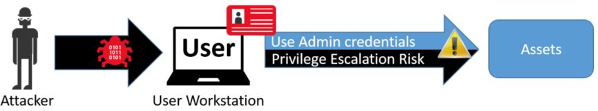

+++
title = "Privileged Access Workstations"
description = "Ask the details you need to know to deploy PAWs in Active Directory.  Find out where to begin."
image = 'images/pawfig2.jpg'
date = 2020-11-01T15:36:24-05:00
weight = 20
pre = "2. "
draft = true
+++

## What is a Privileged Access Workstation - PAW
The PAWs deployment is focused to restrict privileged Active Directory tasks to dedicated workstations to protect against credential theft.  

These workstations sole purpose in life is to perform administrative functions.  It is never used for daily tasks such as checking email, browsing the web, or reading reddit.  These entirety of the machines is separated from the standard workstations and servers on a domain so that there is no cross infection between PAWs and standard workstations and servers on the domain.

Microsoft's Privilege Access Workstation (PAW) instructions are published at [http://aka.ms/cyberpaw](http://aka.ms/cyberpaw). Unfortunately this article takes 80 minutes to read from start to finish. My goal is to get you started by defining the quickest way to deploy a machine that lowers the risk of privileged credential leaks in your environment

## How to build a PAW

Let's dive right into what types of PAWs people use in the wild, where the object stays on the domain.

### Types of PAWs

There are various methods that environments can work toward deploying a secure PAW environment.  Sometimes the best and most secure deployment is not possible in a short period of time.  Keeping that in mind, here are the methods I have seen deployed in various environments.  

Method 1  | Pros | Cons
-- | -- | --
| 1. Server Jumpbox for Administrative Use | Cached Credentials are separated from the workstations | Passwords are typed on a workstation to get to the jumpbox.  If the workstation is compromised, a keylogger can steal the server password. 

> This isn't a good solution, but it is better than Domain Admins and Server Admins from living into workstations.

Method 2 | Pros | Cons
-- | -- | --
| 2. A brand new separate laptop | Administrative credentials are immediately segregated onto a separate workstation.  This is the quickest and cheapest way to deploy and work toward a better security posture | There is still a lot of work to do.  Also an admins now has two separate workstations/laptops to lug around. |

> Better than a jump box, this is not the ultimate solution. However, it's top quality is that credentials are instantly separated from a standard workstation.

Method 3 | Pros | Cons
-- | -- | --
| 3. A shared physical server | Administrative credentials are immediately segregated onto a separate server.  A quick way to work towards securing credential | There is still a lot of work to do.  Dependent on people going to a physical location to use a separate device |

Method 4 | Pros | Cons
-- | -- | --
| 4. Dedicated hardware | Administrative credentials are immediately segregated onto a separate server.  A quick way to work towards securing credential | There is still a lot of work to do.  Dependent on people going to a physical location to use a separate device |

### PAW Storage

Define a place to store the PAW machine objects and administrators that use them. 

1. Download the PAW script from the technet library.  

[PAWS OU Creation Script](https://gallery.technet.microsoft.com/Privileged-Access-53a4673a)

For a full look at what the PAW OU script does, please see [Privileged Access Admin OU](paws_admin_ou)
