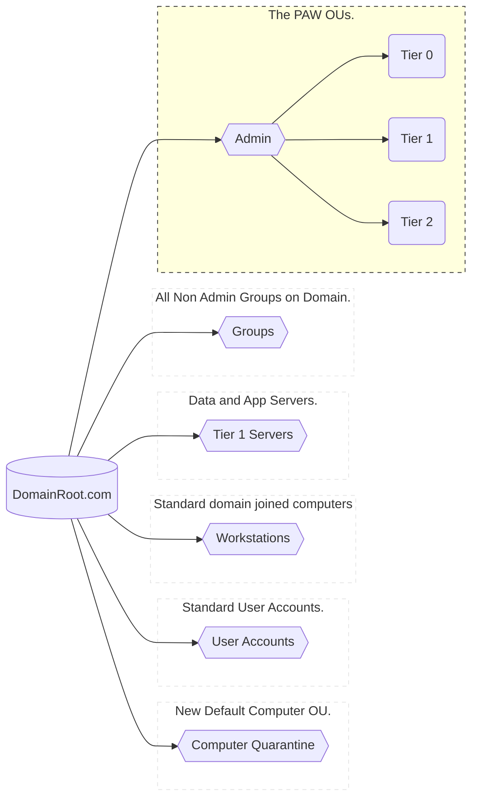
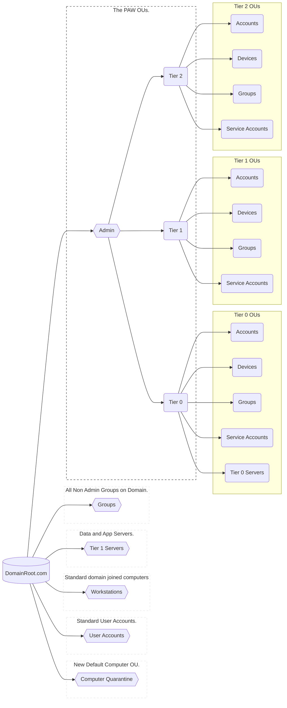

## Begin work towards the Red Forest

With a base understanding of tiers, administrators, unique passwords for computers and a brief definition of why a privileged access workstation is needed for Active Directory Security, it's time to start investing time into making changes in the environment. 

### Prerequisites

1. Download the PAW script from the technet library. [PAWS OU Creation Script](https://gallery.technet.microsoft.com/Privileged-Access-53a4673a)

### PAW Scripts

The zip linked above on the technet article have three scripts with three specific purposes

Script | Purpose
--- | ---
| 1. Create-pawOU | Set up new OU for tiered administration
| 2. Create-pawGroups |  Import groups.csv to create a sample tiered administrator set
| 3. Set-PAWOUdelegation | Use the groups above and set the proper delegation on the new OUs created

> Beginning to deploy Active Directory security is as easy as 1, 2, 3
1. Create OUs
1. Create Groups
1. Push delegation

#### Administrative PAW OU Structure {#oustructure}
The Create-PAWOU script sets up an OU structure to allow administrative objects to be separate and secure from standard AD objects.  The Script goes through steps to set up the following structure:

- [Create OUs](#createous)
    - [Admin Base OU](#adminous)
        - [Tiered Base OUs](#tierous)
            - [Sub OUs under Tiers](#tiersubs)
    - [Non Admin OUs](#grpsous)
        - [Sub OUs]


[Admin OU Drawn Out](#aou_done)

---

### What This Post Covers
1. Create Administrative OUs

>  Remember there is plenty of work to do. Eventually the focus will shift to Tier 1 and Tier 2 credentials.  For this small moment in time, FIRST make sure Tier 0 is secure as possible.

#### Protecting Active Directory and Admin Users and Privileges by creating an administrative OU
 
*CENTRALIZE ADMINISTRATIVE ACCOUNTS:*

The location of the administrative users and groups is often overlooked. If I were to perform an audit on any random domain, there's a major chance that I'd find administrative accounts scattered across multiple Organizational Units. 

> Often by accident this scattered user placement creates pathways that attackers exploit to gain higher level of privileges.


----

## 1. Create Organizations Units {#createous}
### Active Directory PAW & Admin OU Layout
#####  [Back to the OU Top](#oustructure)

The privileged organization unit deploy is a bit different mindset for administrators. Understand that the admin OU is created specifically to secure the Active Directory Domain.

** These OUs are deployed by running the `create-pawou.ps1`

> Security > Everything Else

---

### Base Admin Organizational Unit Structure {#adminous}

#####  [Back to the OU Top](#oustructure)

1. The base OUs are created to store all the relative objects.
2. The base OUs are at the top of the domain, the first level of OUs possible to create on the domain

The Create-PAWOUs.ps1 script dynamically generates the working directory, domain name, and default context with the following code:
```powershell
#Get current working directory
$sLocation = Get-Location

$DomainName = (Get-ADDomain).Name
$sDSE = (Get-ADRootDSE).defaultNamingContext

#$sPath = ("OU="+ $DomainName + " Objects," + $($sDSE))
```

It uses the variables stored above to create the following OU structure at the top of the domain:

OU Name | Purpose | Created with the following code:
--- | --- | --
Admin | Holds all tier 0, 1, 2 user and service accounts, groups, and devices that manage those tiers. Also holds tier 0 computers that are not DCs | `New-ADOrganizationalUnit -Name "Admin" -Path "$sDSE"`
Groups | Holds group objects on the domain. **No tiered** groups here | `New-ADOrganizationalUnit -Name "Groups" -Path "$sDSE"`
Tier 1 Servers | Holds app and data servers. **No PAWs** here | `New-ADOrganizationalUnit -Name "Tier 1 Servers" -Path "$sDSE"`
Workstations | Holds Domain Joined computers (Tier 2 computers) | `New-ADOrganizationalUnit -Name "Workstations" -Path "$sDSE"`
User Accounts | Holds regular user accounts | `New-ADOrganizationalUnit -Name "User Accounts" -Path "$sDSE"`
Computer Quarantine | This is to be the new default computer OU | `New-ADOrganizationalUnit -Name "Computer Quarantine" -Path "$sDSE"`

---

The Active Directory Secure OU structure now begins to take shape:


graph LR;
    A[(DomainRoot.com)]
    A --> B{{Admin}} 
    A --> C{{Groups}}
    A --> D{{Tier 1 Servers}}
    A --> E{{Workstations}}
    A --> F{{User Accounts}}
    A --> G{{Computer Quarantine}}
    


---

### Tier OUs, Sub OUs for the Admin OU {#tierous}

#####  [Back to the OU Top](#oustructure)

In order to not have a 'flat' domain OU structure, Microsoft deploys multiple OUs underneath the 'Admin OU' to store objects that are tiered objects on the domain.  

Admin Sub OU Name | Purpose | Created with the following code:
--- | --- | ---
Tier 0 | Holds all Tier 0 users, service accounts, groups, devices (PAWS) and servers | `powershell New-ADOrganizationalUnit -Name "Tier 0" -Path ("OU=Admin,$sDSE")`
Tier 1 | Holds all Tier 1 users, service accounts, groups, devices (PAWS). **No servers are stored here** | `powershell New-ADOrganizationalUnit -Name "Tier 1" -Path ("OU=Admin,$sDSE")`
Tier 2 | Holds all Tier 2 users, service accounts, groups, devices (PAWS) **No Workstations are stored here**  | `powershell New-ADOrganizationalUnit -Name "Tier 2" -Path ("OU=Admin,$sDSE")`


---

The Active Directory Secure OU structure with the tier OUs is now modified to:


---

### Sub OUs under the Tier OUs in the Admin OU {#tiersubs}

#####  [Back to the OU Top](#oustructure)

The Active Directory Security Administrator now needs to take the step to expand the OUs underneath the Tiered OUs under the Admin OU.  This is also performed by the `Create-PAWOUs.ps1`

#### Sub Ous for Admin\Tier 0 OU {#t0ous}

Tier Sub OU Name | Description | Created with the following code:
--- | --- | ---
Accounts | Tier 0 User (People) accounts | `New-ADOrganizationalUnit -Name "Accounts" -Path ("OU=Tier 0,OU=Admin,$sDSE")`
Groups | Tier 0 Groups - Management groups for Tier 0 Accounts, Service Accounts, Devices, and Tier 0 Servers | `New-ADOrganizationalUnit -Name "Groups" -Path ("OU=Tier 0,OU=Admin,$sDSE")`
Service Accounts | Tier 0 Service Accounts that perform Tier 0 work on schedules | `New-ADOrganizationalUnit -Name "Service Accounts" -Path ("OU=Tier 0,OU=Admin,$sDSE") `
Devices | Tier 0 PAWs | `New-ADOrganizationalUnit -Name "Devices" -Path ("OU=Tier 0,OU=Admin,$sDSE")`
Tier 0 Servers | Tier 0 Servers that manage applications and services on Domain Controllers. [Tier 0 Devices]() | `New-ADOrganizationalUnit -Name "Tier 0 Servers" -Path ("OU=Tier 0,OU=Admin,$sDSE")`

#### Sub Ous for Admin\Tier 1 OU {#t1ous}

Tier Sub OU Name | Description | Created with the following code:
--- | --- | ---
Accounts | Tier 0 User (People) accounts | `New-ADOrganizationalUnit -Name "Accounts" -Path ("OU=Tier 1,OU=Admin,$sDSE")`
Groups | Tier 0 Groups - Management groups for Tier 0 Accounts, Service Accounts, Devices, and Tier 0 Servers | `New-ADOrganizationalUnit -Name "Groups" -Path ("OU=Tier 1,OU=Admin,$sDSE")`
Service Accounts | Tier 0 Service Accounts that perform Tier 0 work on schedules | `New-ADOrganizationalUnit -Name "Service Accounts" -Path ("OU=Tier 1,OU=Admin,$sDSE") `
Devices | Tier 0 PAWs | `New-ADOrganizationalUnit -Name "Devices" -Path ("OU=Tier 1,OU=Admin,$sDSE")`


#### Sub Ous for Admin\Tier 2 OU {#t2ous}

Tier Sub OU Name | Description | Created with the following code:
--- | --- | ---
Accounts | Tier 1 User (People) accounts | `New-ADOrganizationalUnit -Name "Accounts" -Path ("OU=Tier 2,OU=Admin,$sDSE")`
Groups | Tier 1 Groups - Management groups for Tier 1 Accounts, Service Accounts, Devices, and Tier 1 Servers | `New-ADOrganizationalUnit -Name "Groups" -Path ("OU=Tier 2,OU=Admin,$sDSE")`
Service Accounts | Tier 1 Service Accounts that perform Tier 0 work on schedules | `New-ADOrganizationalUnit -Name "Service Accounts" -Path ("OU=Tier 2,OU=Admin,$sDSE") `
Devices | Tier 1 PAWs | `New-ADOrganizationalUnit -Name "Devices" -Path ("OU=Tier 2,OU=Admin,$sDSE")`

---

The Active Directory Secure Admin OU structure is now modified to:



---

### Sub OUs under Groups, Tier 1, Workstations and User Accounts {#subsous}

#### Top Level OU: Groups Sub OUs {#grpsous}

Groups OU Sub OUs Name | Description | Created with the following code:
--- | --- | ---
Security Groups | Groups that provide access to resources | `New-ADOrganizationalUnit -Name "Security Groups" -Path ("OU=Groups,$sDSE")`
Distribution Groups | Place for all email distribution groups | `New-ADOrganizationalUnit -Name "Distribution Groups" -Path ("OU=Groups,$sDSE")`
Contacts | Contains objects with no security permissions.  External Email users | `New-ADOrganizationalUnit -Name "Contacts" -Path ("OU=Groups,$sDSE")`

#### Top Level OU: Tier 1 Servers Sub OUs {#tier1sub}

Tier 1 Servers OU Sub OUs Name | Description | Created with the following code
--- | --- | ---
Application | Servers that run necessary applications on the domain. (.Net, Citrix, task servers etc) | `New-ADOrganizationalUnit -Name "Application" -Path ("OU=Tier 1 Servers,$sDSE")`
Collaboration | I honestly think Microsoft just made this one up. It makes no sense. Feel free to delete things that don't make sense in you environment |  `New-ADOrganizationalUnit -Name "Collaboration" -Path ("OU=Tier 1 Servers,$sDSE")`
Database | Servers hosting database services | `New-ADOrganizationalUnit -Name "Database" -Path ("OU=Tier 1 Servers,$sDSE")`
Messaging | Servers that host cross team communication apps on the domain |  `New-ADOrganizationalUnit -Name "Messaging" -Path ("OU=Tier 1 Servers,$sDSE")`
Staging | Dev/Test OU for testing new deployments | `New-ADOrganizationalUnit -Name "Staging" -Path ("OU=Tier 1 Servers,$sDSE")`

#### Top Level OU: Workstations Sub OUs {#wkssub}

Workstations OU Sub OUs Name | Description | Created with the following code
--- | --- | ---
Desktops | Machines that plug into a wall and don't move from their location very often |  `New-ADOrganizationalUnit -Name "Desktops" -Path ("OU=Workstations,$sDSE")`
Kiosks | SSO machines. Or Workstations on wheels | `New-ADOrganizationalUnit -Name "Kiosks" -Path ("OU=Workstations,$sDSE")`
Laptops | laptops... | `New-ADOrganizationalUnit -Name "Laptops" -Path ("OU=Workstations,$sDSE")`
Staging | Dev/Test OU for testing new deployments | `New-ADOrganizationalUnit -Name "Staging" -Path ("OU=Workstations,$sDSE")`

#### Top Level OU: User Accounts Sub OUs {#usersub}

User Accounts OU Sub OUs Name | Description | Created with the following code
--- | --- | ---
Enabled Users | Standard accounts for people that have access to log into systems |  `New-ADOrganizationalUnit -Name "Enabled Users" -Path ("OU=User Accounts,$sDSE")`
Disabled Users | Standard user accounts that no longer have access to the domain |  `New-ADOrganizationalUnit -Name "Disabled Users" -Path ("OU=User Accounts,$sDSE")`

----
## Full Admin OU Structure {#aou_done}

The full secure Active Directory PAW Admin OU structure laid out is:

```mermaid
graph TD
    root[(DomainRoot.com)] --> 1{{Admin}}
    root --> 2{{Groups}}
    root --> 3{{Tier 1 Servers}}
    root --> 4{{Workstations}}
    root --> 5{{User Accounts}}
    root --> 6{{Computer Quarantine}}
    subgraph 1g[The Privileged Access OUs.]
      1
        1 --> 10(Tier 0)
        1 --> 11(Tier 1)
        1 --> 12(Tier 2)
    end
    subgraph 10g[Tier 0 OUs]
    10 --> B0A0(Accounts)
    10 --> B0D0(Devices)
    10 --> B0G0(Groups)
    10 --> B0SA0(Service Accounts)
    10 --> B0T0S0(Tier 0 Servers)
    end
    subgraph 11g[Tier 1 OUs]
    11 --> B0A1(Accounts)
    11 --> B0D1(Devices)
    11 --> B0G1(Groups)
    11 --> B0SA1(Service Accounts)
    end
    subgraph 12g[Tier 2 OUs]
    12 --> B0A2(Accounts)
    12 --> B0D2(Devices)
    12 --> B0G2(Groups)
    12 --> B0SA2(Service Accounts)
    end
    subgraph 2g[All Non Admin Groups on Domain.]
      2 --> 20(Security Groups)
      2 --> 21(Distribution Groups)
      2 --> 22(Contacts)
    end
    subgraph 3g[Data and App Servers.]
      3 --> 30(Application)
      3 --> 31(Collaboration)
      3 --> 32(Messaging)
      3 --> 33(Database)
      3 --> 34(Staging)
    end
    subgraph 4g[Standard domain joined computers]
      4 --> 40(Desktops)
      4 --> 41(Kiosks)
      4 --> 42(Laptops)
      4 --> 43(Staging)
    end
    subgraph 5g[Standard User Accounts.]
      5 --> 50(Enabled Users)
      5 --> 51(Disabled Users)
    end
    subgraph 6g[New Default Computer OU.]
      6
    end
    
    click 1 "/redforest/phase1/paws/paws_admin_ou/#tierous"
    click 10 "/redforest/phase1/paws/paws_admin_ou/#t0ous"
    click 11 "/redforest/phase1/paws/paws_admin_ou/#t1ous"
    click 12 "/redforest/phase1/paws/paws_admin_ou/#t2ous"
    click 2 "/redforest/phase1/paws/paws_admin_ou/#grpsous"
    click 3 "/redforest/phase1/paws/paws_admin_ou/#tier1sub"
    click 4 "/redforest/phase1/paws/paws_admin_ou/#wkssub"
    click 5 "/redforest/phase1/paws/paws_admin_ou/#usersub"
linkStyle 0,1,2,3,4,5,6 stroke-width:1px;

style 1g fill:transparent,stroke:#323232,stroke-width:1px,stroke-dasharray:5;
style 10g fill:transparent,stroke:#323232,stroke-width:1px,stroke-dasharray:5;
style 11g fill:transparent,stroke:#323232,stroke-width:1px,stroke-dasharray:5;
style 12g fill:transparent,stroke:#323232,stroke-width:1px,stroke-dasharray:5;
style 2g stroke:#E5E5E5,stroke-width:1px,stroke-dasharray:5;
style 3g stroke:#E5E5E5,stroke-width:1px,stroke-dasharray:5;
style 4g stroke:#E5E5E5,stroke-width:1px,stroke-dasharray:5;
style 5g stroke:#E5E5E5,stroke-width:1px,stroke-dasharray:5;
style 6g stroke:#E5E5E5,stroke-width:1px,stroke-dasharray:5;

```



{}
Keep in mind that this OU configuration has zero permissions applied to it. This is just the start of organization that will lead to permissions management.
{}



